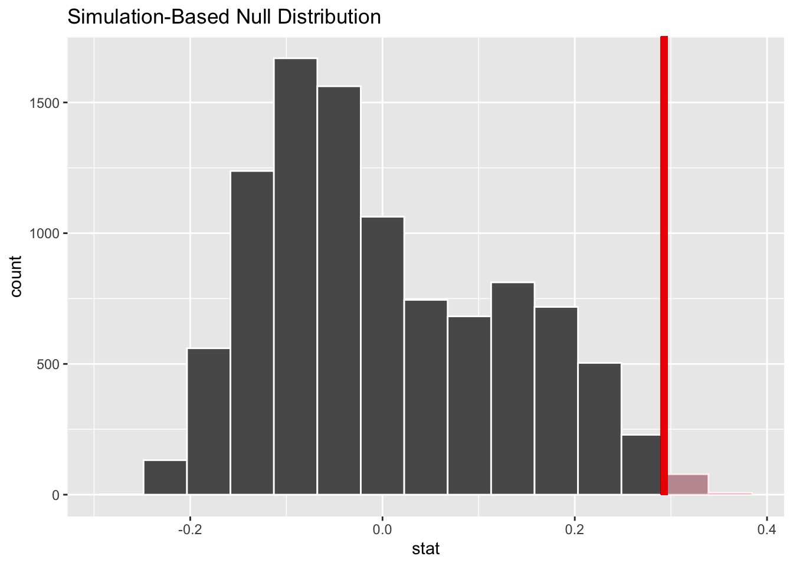

## Bulletin

- Exam 2 due tonight at 11:59pm
- [Final project](/projects/final-project)

## Today

By the end of today you will...

- learn to hypothesis test, the tidy way
- be able to explain the following terms and how they relate: null hypothesis, alternative hypothesis, observed statistic, p-value, simulate under the null


## Getting started

Download this application exercise by pasting the code below into your **console**

```
download.file("https://sta101.github.io/static/appex/ae12.Rmd",
destfile = "ae12.rmd")
```

## Load packages and data


```r
library(tidyverse)
library(tidymodels)
```


## Notes

### Review 

Last time we asked if a coin was fair. We let $p$ be the probability of landing heads. Fundamentally, we were interested in whether or not $p = 0.5$. This was our **null hypothesis**:

$$
H_0: p = 5
$$

and our alternative, was that the coin was biased heads:
$$
H_A: p > 0.5
$$

In one example our data consisted of 30 coin flips and 26 heads. The proportion of heads **that we observed**, $\hat{p} = 26/30 = .87$.

Do these 30 coin flips give us enough evidence to reject the null in favor of the alternative?

To answer this question, we computed the p-value: $Pr(\hat{p} \geq .87 | H_0 \text{ true})$. In words, the probability that our statistic of interest, ($\hat{p}$), is greater than or equal to what we saw given that the null is true.

Notice that the p-value is defined by three things:

- our observed statistic (0.87)
- the null hypothesis ($H_0$) 
- the alternative hypothesis ($H_A$), this tells us *the direction* ($>=$) to shade.

We compared the p-value to some pre-defined cutoff, $\alpha$. In our example we set our cutoff at $\alpha = 0.05$. If p-value $< \alpha$, we reject the null. If p-value $> \alpha$, we fail to reject the null.

### The tidy way


```r
coin_flips = read_csv("https://sta101.github.io/static/appex/data/coin_flips.csv")
```

```
## Rows: 30 Columns: 1
## ── Column specification ────────────────────────────────────────────────────────
## Delimiter: ","
## chr (1): one_flip
## 
## ℹ Use `spec()` to retrieve the full column specification for this data.
## ℹ Specify the column types or set `show_col_types = FALSE` to quiet this message.
```


```r
set.seed(2022)
null_dist = 
  coin_flips %>% 
  specify(response = one_flip, success = "H") %>%
  hypothesize(null = "point", p = 0.5) %>%
  generate(reps = 10000, type = "draw") %>%
  calculate(stat = "prop")

obs_stat = 26/30

visualize(null_dist) +
  shade_p_value(obs_stat, direction = "right")
```


```r
null_dist %>%
get_p_value(obs_stat, direction = "right")
```

```
## # A tibble: 1 × 1
##   p_value
##     <dbl>
## 1  0.0001
```

p-value of $1 \times 10^{-4}$ < 0.05. We reject the null that the coin is fair.

### Not just a coin flip

In general, if we want to test proportion we can do so this way.


- Example:


```r
push_pull = read_csv("https://sta101.github.io/static/appex/data/push_pull.csv")
```

```r
push_pull %>%
  slice(1:3, 24:26)
```

```
## # A tibble: 6 × 7
##   participant_id   age push1 push2 pull1 pull2 training
##            <dbl> <dbl> <dbl> <dbl> <dbl> <dbl> <chr>   
## 1              1    41    41    45    16    17 density 
## 2              2    32    35    44     9    11 density 
## 3              3    44    33    38    10    11 density 
## 4             24    36    31    60     9    15 gtg     
## 5             25    50    35    42     9    12 gtg     
## 6             26    34    23    39     9    13 gtg
```


The `push_pull` dataset comes from a "mini study" by [mountain tactical institute](https://mtntactical.com/knowledge/mini-study-grease-the-groove-beats-density-for-push-up-pull-up-improvement/). 

26 individuals completed 1 of 2 exercise regiments for 3.5 weeks to increase their pushups and pullups. Codebook below:

- `participant_id`: unique identifier for each participant
- `age`: age of participant
- `push1/2`: push-ups at beginning and end of program respectively
- `pull1/2`: pull-ups at beginning and end of program respectively
- `training`: which training protocol the individual participated in


```r
push_pull = push_pull %>%
  mutate(
    pct_push_inc = (push2 / push1 ) - 1,
    pct_pull_inc = (pull2 / pull1) - 1)
```

**Hypothesis**: "Most people who train consistently will see at least a 15% increase in push-ups over a 3.5 week training period."

Breaking it down:

- "Most" i.e. "greater than 50%" indicates we should examine a proportion.

#### Exercise 1

**What's the null?**

- "will see at least a 15% increase". Each person either increases by 15% over 3.5 weeks or does not. This is our binary outcome.

- create a new column called `over_15pct` that tells you whether or not an individual achieved at least a 15% increase in push-ups


```r
# code here
```

- What would be a default theory (null hypothesis)?

#### Exercise 2

Write the null and alternative in mathematical notation.

#### Exercise 3 

What is the observed statistic? Compute and write it in mathematical notation.

#### Exercise 4 

Next, simulate under the null and compute the p-value. State your conclusion with $\alpha = 0.05$. As a bonus, visualize the null distribution and shade in the p-value.

### More than a proportion

- What if we want to make a claim about a different population parameter than a proportion? Maybe a mean, or median? We can't necessarily flip a coin. The answer, is once again, bootstrap sampling.

**Hypothesis**: "The mean age of push-up/pull-up training partcipants is greater than 30".

Let's investigate this hypothesis with a signifiance level $\alpha = 0.01$.

#### Exercise 5

Write down the null and alternative hypotheses in words and mathematical notation


#### Exercise 6

What is the observed statistic? Write it in mathematical notation.

Bootstrapping does the following...


```r
# find observed statistic
obs_mean_age = push_pull %>%
  drop_na(age) %>%
  summarize(meanAge = mean(age)) %>%
  pull()
# subtract observed_mean - desired_mean from age
age_and_null = push_pull %>%
  select(age) %>%
  drop_na(age) %>%
  mutate(nullAge = age - (obs_mean_age - 30))
# show data frame
age_and_null
```

```
## # A tibble: 25 × 2
##      age nullAge
##    <dbl>   <dbl>
##  1    41    35.8
##  2    32    26.8
##  3    44    38.8
##  4    37    31.8
##  5    37    31.8
##  6    21    15.8
##  7    33    27.8
##  8    38    32.8
##  9    49    43.8
## 10    33    27.8
## # … with 15 more rows
```

```r
# show the means of each column
age_and_null %>%
  summarize(meanAge = mean(age),
  mean_nullAge = mean(nullAge))
```

```
## # A tibble: 1 × 2
##   meanAge mean_nullAge
##     <dbl>        <dbl>
## 1    35.2           30
```

If we take bootstrap samples from this new `nullAge` column, we are sampling from data with the same
variability as our original data, but a different mean. This is a nice way to explore the null!


```r
set.seed(3)

# simulate null
null_dist = push_pull %>%
  specify(response = age) %>%
  hypothesize(null = "point", mu = 30) %>%
  generate(reps = 10000, type = "bootstrap") %>%
  calculate(stat = "mean")

# get observed statistic
obs_stat = obs_mean_age

p_value = null_dist %>%
  get_p_value(obs_stat, direction = "right")

p_value
```

```
## # A tibble: 1 × 1
##   p_value
##     <dbl>
## 1  0.0001
```

- The p-value 1e-04 is less than $\alpha = 0.01$. I reject the null hypothesis. In context, there is evidence to suggest
that average push/pull trainee age is older than 30 years old.

#### Exercise 7

Say we are interested in the performance of trainees at this particular facility and the sample is representative of the population.

**Hypothesis**: The median number of pull-ups trainees can perform is less than 20 even after training for 3.5 weeks.

Write down the null and alternative hypothesis in mathematical notation.

#### Exercise 8

Write down the observed statistic. Simulate under the null and compute the p-value. Finally, visualize and interpret the p-value in context.


## Summary

### Hypothesis testing procedure

1. Specify the null and alternative hypothesis. Choose or know $\alpha$.
2. Look at the data, compute the observed statistic.
3. Simulate **under the null** and compute the p-value using the **observed statistic** and the **alternative hypothesis**.
4. Compare the p-value to your significance level $\alpha$ and reject or fail to reject the null. Interpret your result in context.

## Which training method is better?

Two exercise regimes:

- "density" training
- "grease-the-groove" (gtg)

We want to know, is the average pull-up percent increase of a gtg trainee significantly greater than a density trainee?

Fundamentally, does the categorical variable `training` affect the average percentage increase in pull-ups?

**State the null hypothesis**:

$$
\mu_d = \mu_{gtg}
$$

$$
H_0: \mu_d - \mu_{gtg} = 0
$$

What we want to do to simulate data under this null:


```r
random_training = sample(push_pull$training, replace = FALSE)

push_pull %>%
  select(pct_pull_inc) %>%
  mutate(random_training = random_training)
```


#### Exercise 9:

- Complete the hypothesis specification above by stating the alternative.


```r
sim_num = 10000
set.seed(1)
# simulate null
null_dist = push_pull %>%
  specify(response = pct_pull_inc, explanatory = training) %>%
  hypothesize(null = "independence") %>%
  generate(reps = sim_num, type = "permute") %>%
  calculate(stat = "diff in means", order = c("gtg", "density"))
# observed statistic
obs_stat = .489 - .196
# visualize / get p
visualize(null_dist) +
  shade_p_value(obs_stat, direction = "right")
```



#### Exercise 10

Compute the p-value and state your conclusion with $\alpha = 0.05$
